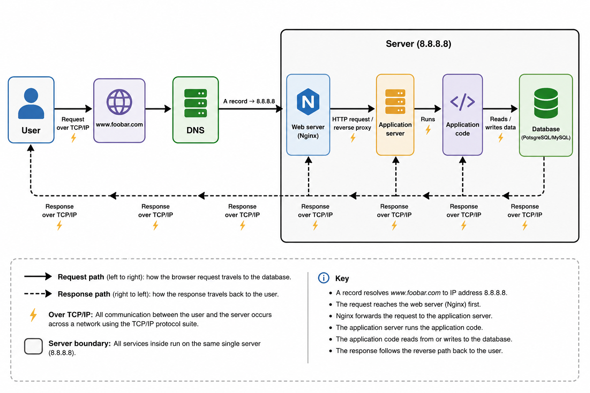

# Introduction to Web Infrastructure Design

This repository contains the answer for **Task 0 — Model a Single-Server Web Stack**.

The design shows how a request for `www.foobar.com` is resolved by DNS, reaches a single server at `8.8.8.8`, passes through the web and application layers to the database, and then returns to the user.

## Task 0 — Model a Single-Server Web Stack

### Diagram



The plain-text version of the same design is in `single_server_stack.mmd`.

### Request path

1. The **User** requests `www.foobar.com`.
2. **DNS** resolves `www.foobar.com`.
3. Its **A record** points to the IPv4 address `8.8.8.8`.
4. The browser connects to the **Web server (Nginx)** on that server.
5. Nginx forwards a dynamic request to the **Application server**.
6. The application server runs the **Application code**.
7. The application code reads from or writes to the **Database (PotsgreSQL/MySQL)**.
8. The result travels back through the application code, application server and Nginx, then across the network to the user.

DNS is part of name resolution before the connection to the web server. The website response does **not** travel back through DNS.

### What is a server?

A server is a computer that provides services to other computers over a network. It may be a physical machine or a virtual machine running on physical hardware.

A server runs an operating system, such as Linux, and is commonly hosted in a data centre with reliable electricity, networking, cooling and physical security.

The **server itself** is the machine. Nginx, the application server, the application code and PostgreSQL/MySQL are software or services running on that machine.

### DNS and the A record

DNS stands for **Domain Name System**. It translates a human-readable hostname such as `www.foobar.com` into an IP address that computers can use to locate the server.

In this design, `www.foobar.com` has an **A record** pointing to `8.8.8.8`. An A record maps a hostname to an IPv4 address.

### Web server — Nginx

The **Web server (Nginx)** receives HTTP requests. It can serve static content directly and can forward requests requiring application processing to the application server as a reverse proxy.

### Application server

The **Application server** handles server-side application requests and runs the application logic through the application code.

### Application code

The **Application code** contains the rules and behaviour of the website. It may validate input, process logins, perform calculations, decide what data is needed and build a response.

### Database

The **Database (PotsgreSQL/MySQL)** stores persistent information such as users, products, posts or orders. The application code reads existing data and writes new or updated data.

### TCP/IP communication

The user's computer and the server communicate across a network using the **TCP/IP protocol suite**.

IP handles addressing and routing between machines. TCP provides reliable delivery of data between endpoints. HTTP or HTTPS normally operates on top of TCP/IP.

### LAMP

**LAMP** traditionally means:

- **L** — Linux
- **A** — Apache
- **M** — MySQL
- **P** — PHP

This design is **LAMP-like**, not a literal LAMP stack. It uses **Nginx instead of Apache**, and it does not require PHP as the application language.

### Limitations of this design

#### Single point of failure — SPOF

The one server is a **single point of failure (SPOF)**. If the machine fails, the web server, application server, application code and database all become unavailable.

#### Downtime during maintenance

Because all services run on one machine, restarting or shutting down that machine for maintenance can make the entire website unavailable.

#### Capacity limit

One server has finite CPU, memory, disk and network capacity. As traffic increases, the machine can become slow or eventually fail to handle additional requests.

### Self-validation

- [x] `single_server_stack.mmd` contains the complete single-server design using plain-text boxes and arrows.
- [x] The image contains every required component label and one explicit server boundary.
- [x] The request reaches **Web server (Nginx)** before the application server.
- [x] The request path continues through **Application server → Application code → Database (PotsgreSQL/MySQL)**.
- [x] The response returns **Database → Application code → Application server → Web server (Nginx) → User**.
- [x] DNS is used for hostname resolution and is not shown as a hop in the response path.
- [x] The A record points `www.foobar.com` to `8.8.8.8`.
- [x] The README distinguishes the server machine from the services running on it.
- [x] The README explains TCP/IP.
- [x] The README defines LAMP and explains why this design is only LAMP-like.
- [x] The README identifies the SPOF, maintenance downtime risk and capacity limitation.

## Repository structure

```text
holbertonschool-web_infrastructure_design/
└── web_infrastructure_design/
    ├── README.md
    ├── single_server_stack.mmd
    └── single_server_stack.png
```
