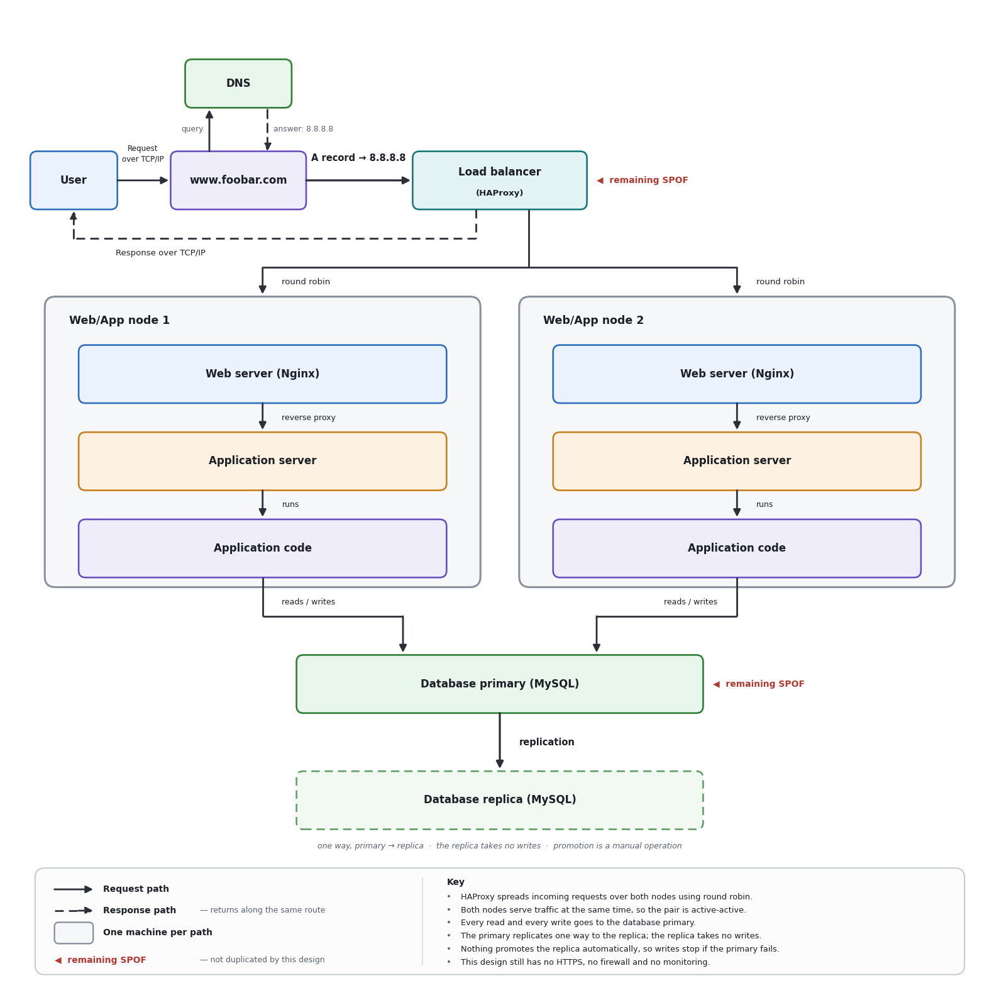

# Introduction to Web Infrastructure Design

This directory contains the web infrastructure designs for this project, one
section per task, together with the diagram source and its rendered image.

Each design is delivered as a plain-text diagram (`.mmd`) and a rendered image
(`.png`). The plain-text representation is used instead of Mermaid source with
the agreement of the project supervisor; the diagram content, labels, boundaries
and connection directions follow the requirements of the task in full.

## 0. Model a Single-Server Web Stack

### Diagram


The plain-text version of the same design is in `single_server_stack.mmd`.

### Request path

1. The **User** opens `www.foobar.com` in a browser.
2. The name `www.foobar.com` is resolved by **DNS**, which answers with the
   IPv4 address `8.8.8.8`.
3. The browser then connects straight to `8.8.8.8`, the address held in the
   **A record** for `www.foobar.com`. This is the connection into the
   server-side entry point of the design.
4. The **Web server (Nginx)** is that entry point. It accepts the HTTP request.
5. Nginx serves static content itself, and reverse-proxies anything that needs
   processing to the **Application server**.
6. The application server runs the **Application code**.
7. The application code reads from and writes to the
   **Database (PotsgreSQL/MySQL)**.
8. The response travels back the other way: database → application code →
   application server → Nginx → user.

Name resolution happens *before* the connection is opened. It is a lookup to the
side of the request path, not a hop along it, which is why the response does not
travel back through it. The diagram shows this by placing the resolution step
beside `www.foobar.com` rather than between it and the server.

### What is a server?

A server is a computer that provides services to other computers over a network.
It may be a **physical machine**, or a **virtual machine** running on physical
hardware shared with other virtual machines.

A server runs an **operating system**, such as Linux, which manages its CPU,
memory, storage and network interfaces and which the services depend on.

A server is commonly hosted in a **data centre**, which supplies reliable
electricity, network connectivity, cooling and physical security rather than
relying on an office or a home connection.

The **server is the machine**; Nginx, the application server, the application
code and PostgreSQL/MySQL are **services and software running on that machine**.
Restarting a service is not the same as restarting the server, and the machine
can be healthy while a service on it has failed.

### DNS and the A record

**DNS** stands for **Domain Name System**. It is the distributed directory that
translates a human-readable name such as `www.foobar.com` into the IP address a
browser needs in order to open a connection. Without it, users would have to
know and type the address of every site they visit.

In this scenario the `www` record is an **A record** because the value it has to
return is a **literal IPv4 address**, `8.8.8.8`. An A record is exactly the
record type that maps a hostname to an IPv4 address. Had `www` needed to point
at *another hostname* instead, the correct record type would have been a
**CNAME**; had the target been an IPv6 address, it would have been an **AAAA**
record. The design places one machine at one IPv4 address, so an A record is the
right choice.

### Web server — Nginx

The **Web server (Nginx)** is what listens for incoming HTTP requests and is the
first component of the server side to see a request. It serves static files such
as images, stylesheets and scripts directly, and acts as a **reverse proxy**,
forwarding requests that need application logic to the application server and
returning that answer to the client.

### Application server

The **Application server** is the runtime that hosts the application. It receives
the requests Nginx forwards, executes the application code for each one inside a
process it manages, and hands the produced response back to Nginx.

### Application code

The **Application code** is the part written for this particular website — its
business logic. It validates input, handles authentication, decides which data is
needed, applies the rules of the site and builds the response body.

### Database

The **Database (PotsgreSQL/MySQL)** stores the data that has to outlive a single
request: accounts, sessions, posts, orders and so on. The application code reads
from it to answer requests and writes to it to record changes.

### TCP/IP communication

The user's computer and the server communicate across a network using the
**TCP/IP protocol suite**.

**IP** is responsible for addressing and routing: it is what makes `8.8.8.8`
reachable and gets packets from the user's network to the server's network.
**TCP** runs on top of IP and provides a reliable, ordered, connection-oriented
byte stream between the two endpoints, retransmitting anything lost on the way.
**HTTP** (or HTTPS) is then carried inside that TCP connection. The request and
the response in this design both cross the network this way.

### LAMP

**LAMP** is a historical acronym for a common web stack:

- **L** — Linux, the operating system
- **A** — Apache, the web server
- **M** — MySQL, the database
- **P** — PHP (or Perl/Python), the application language

This design is **LAMP-like rather than a literal LAMP stack**. It follows the
same shape — one Linux machine hosting a web server, an application runtime and a
relational database — but it uses **Nginx in place of Apache**, and it does not
prescribe PHP as the application language. Calling it a LAMP stack would
therefore be inaccurate.

### Limitations of this design

#### Single point of failure — SPOF

Every component sits on one machine, which makes that machine a **single point of
failure (SPOF)**. If it loses power, loses network, runs out of disk or suffers a
hardware fault, the web server, the application server, the application code and
the database all go down together. There is nothing else to serve the site.

#### Downtime during maintenance

Any maintenance that requires restarting the machine — a kernel upgrade, a
hardware change, a configuration change that needs a reboot — takes the whole
site offline for the duration. Even restarting a single service, such as
deploying new application code, interrupts the requests it was serving, because
there is no second copy to take the traffic in the meantime.

#### Capacity limit

One machine has a fixed amount of CPU, memory, disk I/O and network bandwidth,
which every service must share. As the number of queries per second (QPS) rises,
those services compete with each other — the database and the application code in
particular — and response times grow until requests start being refused. The only
way to grow is to make the single machine bigger, and that has a ceiling.

### Self-validation

- [x] `single_server_stack.mmd` renders successfully.
- [x] The diagram contains every required label and one explicit server boundary.
- [x] The diagram shows directional request and response paths.
- [x] The README correctly identifies the A record and explains DNS.
- [x] The README distinguishes the machine, web server, application server, application code, and database.
- [x] The README explains TCP/IP and defines LAMP without calling the Nginx design a literal LAMP stack.
- [x] The README identifies the three required limitations.

Note on the first item: with the supervisor's agreement, `single_server_stack.mmd`
holds a plain-text diagram rather than Mermaid source, and
`single_server_stack.png` is the rendered image. Both were checked to display
correctly and to carry the same components, labels, boundary and connection
directions.

Additional checks carried out on this design:

- [x] Each required label appears exactly once: `User`, `www.foobar.com`, `DNS`,
      `Web server (Nginx)`, `Application server`, `Application code`,
      `Database (PotsgreSQL/MySQL)`.
- [x] The connection leaving `www.foobar.com` towards the server-side entry point
      carries the label `A record → 8.8.8.8`.
- [x] Every connection is drawn with a direction.
- [x] The request reaches `Web server (Nginx)` before the application layer.
- [x] The response returns database → application code → application server →
      Nginx → user, and is not routed back through name resolution.
- [x] No load balancer, redundant application path, security control or
      monitoring control appears in the design.
- [x] All text files are UTF-8 and end with a newline.

## 1. Add Redundancy and Traffic Distribution

### Diagram



The plain-text version of the same design is in `redundant_web_tier.mmd`.

### What was added, and why

**The load balancer.** In the previous design, `www.foobar.com` resolved to the
one machine that ran everything, so there was no way to add a second machine
without changing DNS. A **Load balancer (HAProxy)** replaces that machine as the
address the A record points to. It becomes the single public entry point and
spreads incoming requests over the machines behind it. That is what makes it
possible to have more than one web/application machine at all: clients keep using
one name and one address, and the balancer decides which machine actually serves
each request.

**The second web/application path.** `Web/App node 1` and `Web/App node 2` are
two separate machines, each running its own **Web server (Nginx)** and its own
**Application server** with the application code. This buys two different things
at once. Availability: if one machine is lost — hardware fault, failed
deployment, reboot for a kernel upgrade — the balancer stops sending requests to
it and the site stays up on the other one. Capacity: two machines have twice the
CPU, memory and connection capacity of one, so the design serves a higher QPS
than the single-server version before requests start queueing.

**The database split.** One database has become a **Database primary (MySQL)**
and a **Database replica (MySQL)**, with the primary streaming its changes to the
replica. This gives a second, continuously updated copy of the data on another
machine.

### Active-active or active-passive?

The two application paths here are **active-active**. Both nodes are in the
balancer's pool at the same time and both receive live traffic; neither is
sitting idle waiting for the other to fail.

In an **active-passive** arrangement, only one node would receive traffic and the
second would run as a standby, taking over only when the active one is declared
dead. The differences that matter in practice:

- **Capacity.** Active-active uses the capacity of both machines, so the pair
  serves roughly twice the traffic. Active-passive pays for two machines but gets
  the throughput of one; the standby's capacity is insurance, not usable headroom.
- **Recovery.** Active-active has nothing to switch on when a node dies — the
  remaining node simply absorbs the traffic, though it must be able to carry the
  whole load alone. Active-passive needs a failover step, and the site is
  unavailable for however long that takes.
- **State.** Active-active requires that any request can be served by either node,
  so session data, uploads and caches must not live only on one machine. It also
  requires the two machines to be genuinely identical in configuration, otherwise
  users get different behaviour depending on which node they land on.
  Active-passive avoids that problem, which is why it is often the simpler choice
  for components that are hard to run in more than one copy.

### Load-distribution method — round robin

The balancer here uses **round robin**. It keeps the nodes in a list and sends
each new request to the next node in turn: first request to node 1, second to
node 2, third back to node 1, and so on. Over many requests each node ends up with
an equal share.

Round robin is simple and predictable, and it is a good fit when the nodes have
the same specification and requests cost roughly the same to serve. It has a
weakness worth naming: it counts requests, not work. If some requests are far more
expensive than others, a node can be given several heavy requests in a row while
the other handles cheap ones, and the two nodes end up unevenly loaded even though
they received the same number of requests. Other methods address this — for
example **least connections**, which sends each request to the node currently
holding the fewest open connections, or **source hashing**, which always sends a
given client IP to the same node when a user must stay on one machine.

### Database primary, replica, and the replication flow

The **Database primary (MySQL)** is the only node that accepts writes. Both
application servers send all of their traffic to it: inserts, updates and deletes
because it is the only node that can take them, and reads because it always holds
the newest data.

The **Database replica (MySQL)** is a second copy of the same data on another
machine. It is **read-only**: it does not accept writes from the application.

**Replication** is the one-way flow drawn from the primary to the replica. The
primary records every change it commits, the replica receives that stream and
applies the same changes in the same order, and so converges on the same contents.
Replication is usually **asynchronous**, which means the primary does not wait for
the replica before confirming a write to the application, and the replica can
therefore be slightly behind — the gap is called replication lag.

What the replica is useful for: read-only queries can be pointed at it to take
load off the primary; backups and heavy reporting queries can be run against it
without slowing down live traffic; and it is a warm, current copy of the data
sitting ready on another machine.

What it does not do, in this design: **nothing here promotes the replica
automatically.** There is no failover mechanism in the diagram. If the primary is
lost, a person has to decide the primary is really gone, promote the replica to be
the new primary, and repoint the application at it. Until that happens, writes
fail. Replication protects the **data** — a current copy exists elsewhere — but on
its own it does not protect **write availability**, and it never makes the replica
writable.

### Remaining single points of failure

**The load balancer (HAProxy).** There is exactly one, and every request must pass
through it. If it fails, or the machine it runs on fails, the site is unreachable
even though both web/application nodes are healthy and the database is fine. The
component added to remove a SPOF has itself become one.

**The writable database primary (MySQL).** There is exactly one node that accepts
writes. If it fails, anything that writes — logging in, placing an order, posting
— stops working, and stays broken until someone promotes the replica by hand.
Reads could in principle continue from the replica, but only if the application
was configured to fall back to it, and even then the data would be frozen at
whatever the replica had received before the primary died.

So the redundancy in this design covers the web and application tier only. The
entry point and the write path are still single.

### Limitations: no HTTPS, no firewall, no monitoring

**No HTTPS.** All traffic travels as plain HTTP. Anything on the network path
between the user and the balancer can read it — credentials, session cookies,
personal data — and can modify responses in transit. There is also no certificate,
so a client has no way to verify it is really talking to `www.foobar.com` rather
than to something impersonating it. The traffic between the balancer and the
nodes, and between the nodes and the database, is equally unencrypted.

**No firewall.** Nothing restricts which addresses can reach which ports. The
database ports and the application server ports are reachable from anywhere the
machines are reachable from, not only from the components that legitimately need
them. Every service running on every machine is exposed, whether or not it was
meant to be public.

**No monitoring.** Nothing collects metrics, logs or alerts. There is no view of
QPS, error rates, response times, node health or replication lag. That has a
direct operational consequence: a failed node, a primary that has stopped
accepting writes, or a replica that has silently fallen hours behind will all be
discovered by users complaining, not by the people running the system. It also
means there is no measured demand on which to base a decision about when a third
node is actually needed.

### The cost of redundancy

Redundancy improves availability, capacity, or both — but it is not free, and the
cost shows up in two places.

**Infrastructure cost.** This design runs four machines where the previous one ran
one: the balancer, two web/application nodes, and two database machines. That is
more to rent or buy, more power and rack space, and more network traffic between
components. Note also that redundancy for availability and redundancy for capacity
are not the same purchase: if the site must survive losing a node, each node has to
be able to carry the full load alone, which means running both at roughly half
their capacity in normal operation and paying for headroom that is idle most of
the time.

**Operational cost.** Every change now has to be applied consistently in more than
one place, and a configuration drift between the two nodes produces bugs that
appear only for some users. Deployments touch several machines instead of one.
Replication is a component in its own right — it can lag, it can break, and
someone has to notice and repair it. The failover that the replica makes possible
is a manual procedure that must be written down and rehearsed, or it will not work
when it is needed. And every added component is one more thing to patch, secure
and eventually monitor.

The general point: redundancy converts a hardware problem into an operational one.
It is worth paying for where the measured demand or the availability requirement
justifies it — which is an argument for adding the monitoring this design is still
missing, so that the decision rests on numbers rather than on guesswork.

### Self-validation

- [x] `redundant_web_tier.mmd` renders successfully.
- [x] One load balancer sends requests to two distinct web/application paths.
- [x] Each path contains a web server and an application server.
- [x] The database primary replicates to the replica through the required labeled edge.
- [x] The README explains active-active versus active-passive and the selected distribution method.
- [x] The README explains the purpose and cost of redundancy and identifies the remaining SPOFs.
- [x] The README identifies the missing security and monitoring controls.

Note on the first item: as for the previous design, `redundant_web_tier.mmd` holds
a plain-text diagram rather than Mermaid source, with `redundant_web_tier.png` as
the rendered image. Both were checked to display correctly and to carry the same
components, labels, boundaries and connection directions.

Additional checks carried out on this design:

- [x] The required labels are present: `Load balancer (HAProxy)`,
      `Web server (Nginx)` and `Application server` once in each path,
      `Database primary (MySQL)`, `Database replica (MySQL)`.
- [x] The two paths are distinguished by the boundaries `Web/App node 1` and
      `Web/App node 2`.
- [x] The edge from the primary to the replica is directed and labeled
      `replication`.
- [x] Every connection is drawn with a direction.
- [x] Neither the diagram nor the text claims that the replica accepts writes, or
      that replication on its own keeps writes available.
- [x] All text files are UTF-8 and end with a newline.

## Repository structure

```text
holbertonschool-web_infrastructure_design/
├── README.md
└── web_infrastructure_design/
    ├── README.md
    ├── single_server_stack.mmd
    ├── single_server_stack.png
    ├── redundant_web_tier.mmd
    └── redundant_web_tier.png
```
